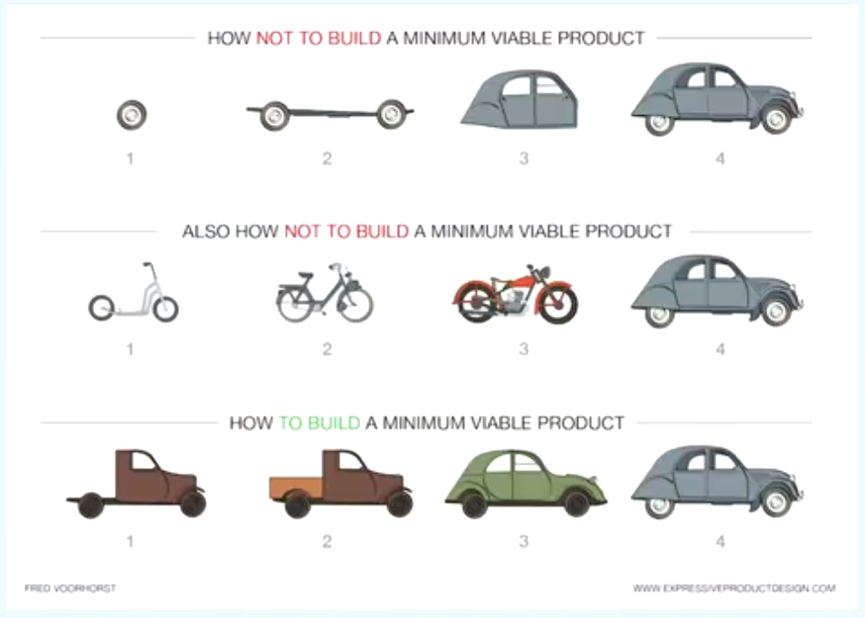

# Einteilung in Frontend und Backend
Leon und Daniel haben bereits Erfahrung im backend und sich dafür gemeldet.

----

# Erste Besprechung

----

# Technologien
- websockets für realtime Kommunikation
- JWT für einfach Authentifizierung
- Elixir für verteilte fehlertolerante Server-Applikationen
  - Leon hatte ein wenig Vorerfahrung, Daniel noch nicht
  - für diesen usecase sehr gut geeignet - weil dinge

----

# Probleme
- Rahmenbedingungen des Spiels wurden erst spät geklärt
- Erste frontend/backend Besprechung ohne tiefgründiges Verständnis des Spiels
  -> Missverständnisse untereinander
- Sehr vage Planung
  -> Dokumentationsformat nicht geeignet
  -> Dokumentation hat nicht übereingestimmt mit dem Spiel
- Fehlende Absprache mit der Fragengruppe
  -> Manche Fragen Kategorien können nicht ausgewertet werden
  -> Dateiformat verbesserungswürdig

----

# Milestones
- Milestones zu grob, nicht messbar, zu optimistisch (Gruppenintern und -übergreifend)
  -> Trello war fürn Arsch
  -> konnte sich nicht dran orientieren
  -> konnte nicht sehen, wie das Frontend sich entwickelt hat
  -> zu wenig Koordination durch Teamleiter
- Milestones nicht zwischen den Gruppen abgesprochen

----

# Development
- Viele features entwickelt, ohne Integration zu testen, ohne Test der Funktionalität

----

---

->Tests->State->Websocket->transformation
